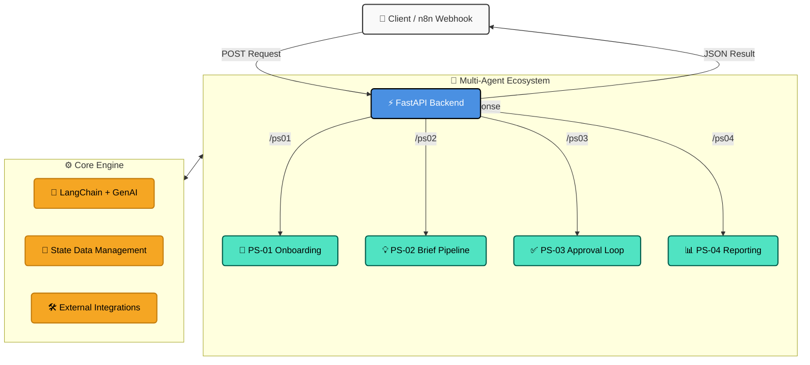
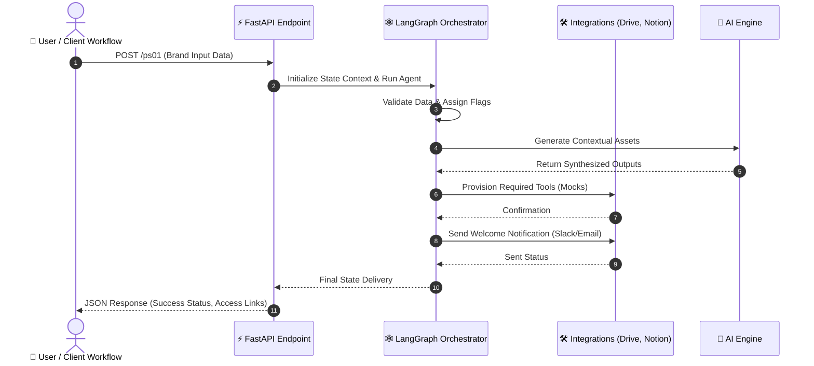

<div align="center">

# 🚀 Scrollhouse Agentic AI System

*A robust, multi-agent operational platform built with [LangGraph](https://python.langchain.com/docs/langgraph) and [FastAPI](https://fastapi.tiangolo.com/). This system is meticulously designed to automate complex, multi-step operational workflows through dedicated, intelligent agents.*

</div>

---

## 🌟 Features

* **⚡ FastAPI Backend**: High-performance RESTful endpoints to seamlessly trigger agentic workflows.
* **🧠 LangGraph Integration**: State-of-the-art graph-based agent state management making processes reliable and trackable.
* **🤖 Multi-Agent Ecosystem**: Dedicated agents for varied operational procedures:
  * **PS-01**: Client Onboarding Workflow
  * **PS-02**: Content & Brief Generation Pipeline
  * **PS-03**: Iterative Approval Loop & Quality Assurance
  * **PS-04**: Analytics & Automated Reporting
* **💡 AI Powered**: Harnesses the power of Langchain and Google GenAI for dynamic and intelligent decision-making.

---

## 🏛️ Architecture Overview

The system processes client requests via its FastAPI interface, delegating core tasks to specialized LangGraph agents. Each agent maintains its execution state safely and utilizes necessary tools to fulfill operational dependencies.



---

## 🛤️ Standard User Flow

Below is the execution flow utilizing **PS-01 (Client Onboarding)** as an example. It illustrates exactly how an agent acts continuously from taking input data to processing requirements using internal logic and integrated tools.



---

## 🛠️ Project Structure

```text
The-Lurkers/
├── agents/                  # Independent agent graphs
│   ├── ps01_onboarding.py   # Initial client onboarding logic
│   ├── ps02_brief_pipeline.py # Brief drafting procedures
│   ├── ps03_approval_loop.py  # Script review processes
│   └── ps04_reporting.py    # Insight report deliveries
├── core/                    # Shared resources and engine components
│   ├── llm.py               # GenAI instance handling
│   ├── state.py             # Agent state class declarations
│   ├── tools.py             # External mock actions and tools
│   └── logger.py            # Console output tracing
├── main.py                  # Endpoints initialization via FastAPI
└── requirements.txt         # Project pip dependencies
```

---

## 🚀 Getting Started

### 1️⃣ Prerequisites
Make sure you have **Python 3.9+** installed natively or within a preferred environment.

### 2️⃣ Installation
After ensuring your environment, install the necessary project requirements:

```bash
pip install -r requirements.txt
```

### 3️⃣ Spinning up the Server
Start the development server using `uvicorn`:

```bash
uvicorn main:app --host 0.0.0.0 --port 8000 --reload
```

The system will begin execution locally at: `http://localhost:8000/`.  
*Tip: You can navigate to `http://localhost:8000/docs` to test all active endpoints directly from the interactive OpenAPI dashboard.*

---

<div align="center">

> _"Automating the mundane so you can focus on the insane."_ ✨

</div>
